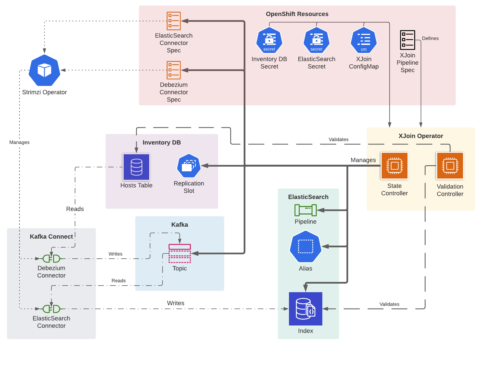

XJoin (Cross Join) Operator
==============

Openshift operator that manages the [XJoin pipeline](https://clouddot.pages.redhat.com/docs/dev/services/xjoin.html).
It currently manages the M2 version of XJoin,
i.e. it maintains the replication pipeline between HBI and ElasticSearch.
Modifications will be necessary to support M3 (joining data between applications).

A XJoin pipeline is defined by the
[XJoinPipeline custom resource](./config/crd/bases/xjoin.cloud.redhat.com_xjoinpipelines.yaml).
It indexes the hosts table of the HBI database into an ElasticSearch index.
A Debezium Kafka Connector is used to read from the HBI database's replication slot.
An ElasticSearch connector is used to index the hosts.
Kafka Connect transformations are performed on the ElasticSearch connector to prepare the host records to be indexed.
An ElasticSearch pipeline is used to transform the JSON fields on a host prior to being indexed.



The operator is responsible for:

- management of an ElasticSearch index, alias, and pipeline
- management of Debezium (source) and ElasticSearch (sink) connectors in a Kafka Connect cluster (using Strimzi)
- management of a Kafka Topic in a Kafka cluster (using Strimzi)
- management of the HBI replication slot. The Debezium connector should manage this. The operator ensures there are no
  orphaned replication slots.
- periodic validation of the indexed data
- automated recovery (e.g. when the data becomes out-of sync)

## Implementation

The operator defines two controllers that reconcile a XJoinPipeline
* [PipelineController](./controllers/xjoinpipeline_controller.go) which manages all the resources
  (connectors, elasticsearch resources, topic, replication slots) and handles recovery
* [ValidationController](./controllers/validation_controller.go) which periodically compares the data in the
  ElasticSearch index with what is stored in HBI to determine whether the pipeline is valid

## Development
### Setting up the development environment using Clowder
1. Install the latest version of [bonfire](https://github.com/RedHatInsights/bonfire)
2. Set up a local Kubernetes environment. Known to work with the following:
   - [CodeReady Containers](https://developers.redhat.com/products/codeready-containers/overview)
   - [MiniKube](https://minikube.sigs.k8s.io/docs/start/)

3. Configure Kubernetes to use at least 16G of memory and 6 cpus. This is known to work, although you can try with less.
    ```
    ./crc config set memory 16384
    ./crc config set cpus 6
    ```
    ```
    minikube config set cpus 6
    minikube config set memory 16384
    ```

4. If using minikube, use the kvm2 driver. The docker driver is known to cause problems.
   ```
   minikube config set driver kvm2
   ```
   
5. Start Kubernetes
    ```
    ./crc start
    ```
    ```
    minikube start
    ```

6. If using CRC
   - When prompted for a pull secret paste it (you obtained pull secret on step 1 when downloading CRC)
   - Log in to the cluster as kubeadmin (oc login -u kubeadmin -p ...)
     You'll find the exact command to use in the CRC startup log

7. Login to https://quay.io and https://registry.redhat.io
   - `docker login -u=<quay-username> -p="password" quay.io`
   - `docker login https://registry.redhat.io`
   - For MacOS, do the following to place the creds in .docker/config.json, which are stored in `"credsStore": "desktop"|"osxkeystore"` and are not available for pulling images from private repos.
      1. `docker logout quay.io`
      1. `docker logout registry.redhat.io`
      1. Remove the "credStore" block from .docker/config.json.
      1. `docker login -u=<quay-username> -p="password" quay.io`
      1. `docker login https://registry.redhat.io`
      - NOTE: Manually creating the `.docker/config.json` and adding `"auth": base64-encoded username:password` does not work.

8. Append the following line into `/etc/hosts`
    ```
    127.0.0.1 kafka-kafka-0.kafka-kafka-brokers.test.svc
    127.0.0.1 inventory-db host-inventory-db.test.svc xjoin-elasticsearch-es-default.test.svc connect-connect-api.test.svc xjoin-elasticsearch-es-http
    ```

9. `./dev/setup-clowder.sh`

### Forward ports
To access the services within the Kubernetes cluster there is a script to forward ports to each of the useful services:
```bash
./dev/forward-ports-clowder.sh
```
   
### Reset the development environment
The Openshift environment can be deleted with this script:
```bash
./dev/teardown.sh
```

Afterwards, the environment can be setup again without restarting Kubernetes via `dev/setup.sh`.
   
### Running the operator locally

With the cluster set up it is now possible to install manifests and run the operator locally.

1. Install CRDs
    ```
    make install
    ```

1. Run the operator
    ```
    make run ENABLE_WEBHOOKS=false
    ```

1. Finally, create a new pipeline
    ```
    kubectl apply -f ../config/samples/xjoin_v1alpha1_xjoinpipeline.yaml -n test
    ```

There is also `make delve` to debug the operator. After starting the Delve server process, connect to it with a Delve debugger.

### Running the operator locally via OLM

This is useful when testing deployment related changes. It's a little cumbersome for everyday development because an 
image needs to be built by app-interface and pushed to the cluster for each change.

- To deploy the operator via locally OLM run
```bash
./dev/install.operator.locally.sh
```

- To uninstall the OLM deployed operator run
```bash
./dev/uninstall.operator.locally.sh
```

### Running the operator locally via OLM using operator-sdk run bundle

This is more convenient than using the app-interface build because the build is done locally then pushed to quay.io.
[More info](https://sdk.operatorframework.io/docs/olm-integration/testing-deployment)

```bash
docker login -u=$QUAY_USERNAME -p $QUAY_PASSWORD
./dev/install.operator.with.operator.sdk.sh
```

`./dev/uninstall.operator.with.operator.sdk.sh ` to uninstall.

### Running tests

- The tests require an initialized Kubernetes environment. See [Setting up the development environment](#development).
- Before running the tests, make sure the operator is not already running on your machine or in the cluster.
  ```
  kubectl scale --replicas=0 deployments/xjoin-operator-controller-manager -n xjoin-operator-system
  ```
- They can be executed via `make test`.
- There is also `make delve-test` to run the tests in debug mode. Then `delve` can be used to connect to the test run.
- The tests take a while to run. To whitelist one or a few tests, prepend `It` with an F. e.g. change `It("Creates a connector...` to `FIt("Creates a connector...) {`
- Sometimes when the test execution fails unexpectedly it will leave orphaned projects in kubernetes. Use `dev/cleanup.projects.sh` to remove them.
